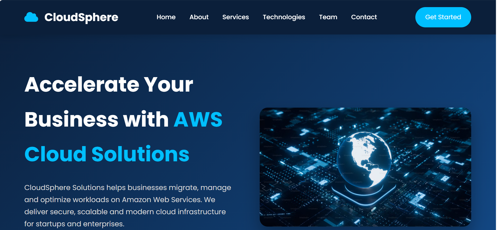
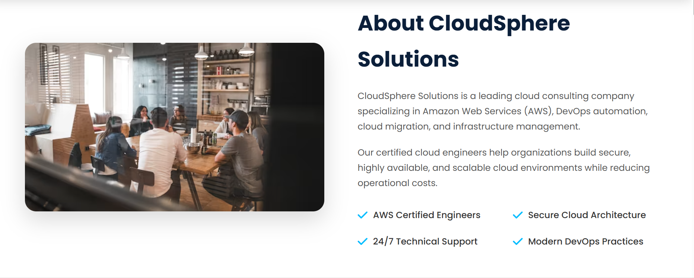
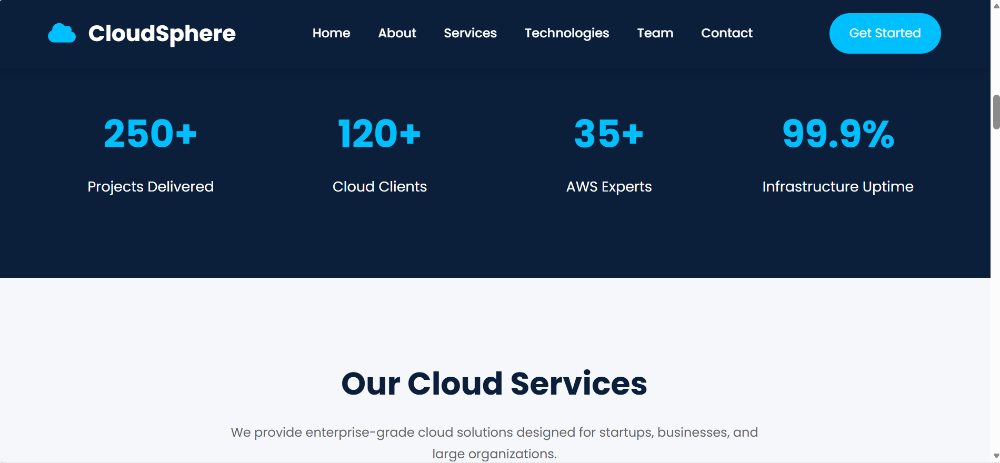
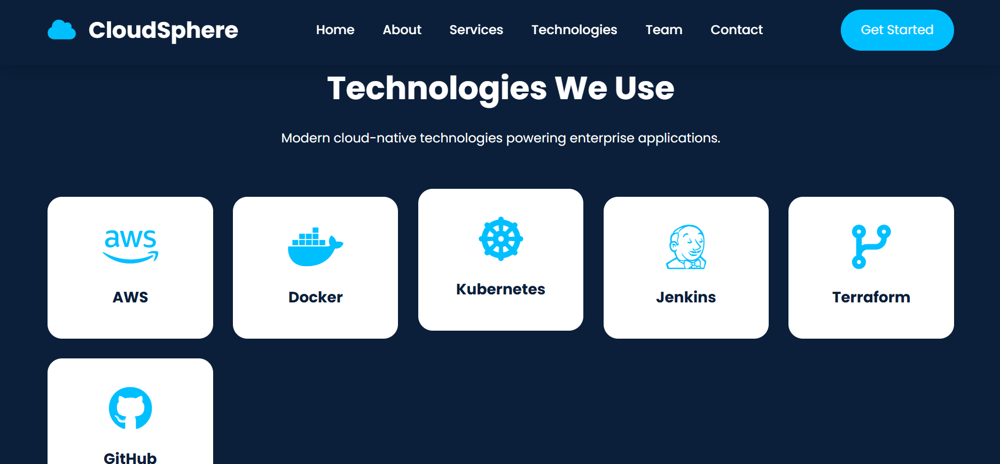
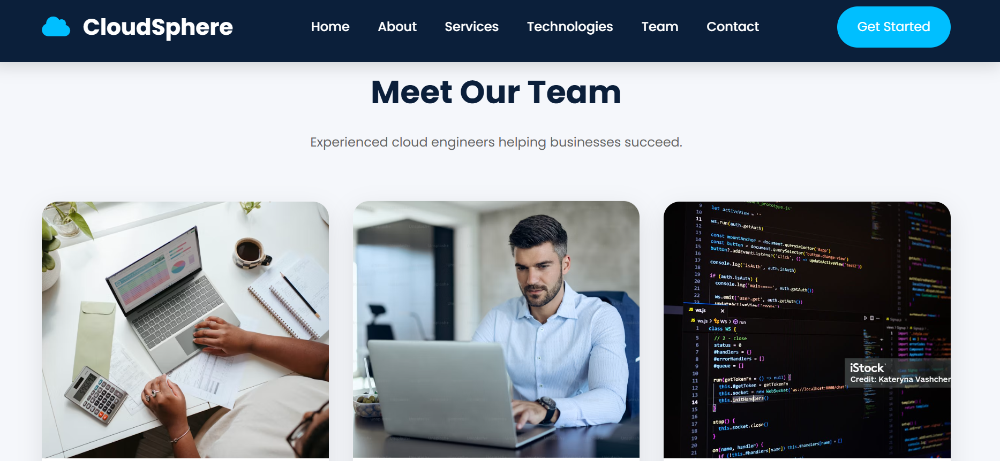
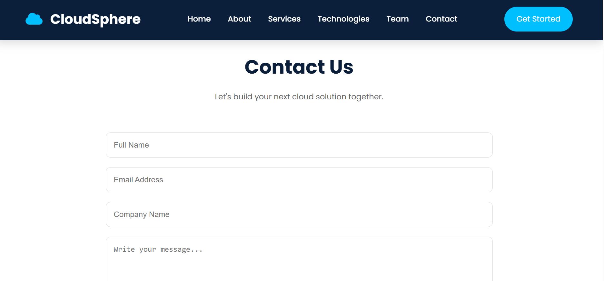

# ☁️ CloudSphere Solutions

## AWS EC2 Windows Server IIS Website Hosting


> A responsive business website deployed on **AWS EC2 Windows Server** using **Microsoft Internet Information Services (IIS)**. This project demonstrates practical cloud deployment, Windows Server administration, IIS configuration, and front-end web development.

---

# 🔗 Repository

**GitHub Repository**

https://github.com/Ajwafarooq/aws-window-IIS-website-hosting

---

# 📌 Project Overview

CloudSphere Solutions is a fictional cloud consulting company website developed to simulate a real-world cloud deployment scenario.

The website was built using **HTML5**, **CSS3**, and **JavaScript**, then deployed on an **AWS EC2 Windows Server** using **Microsoft IIS**.

The objective of this project was to gain hands-on experience with cloud infrastructure, Windows Server management, IIS configuration, GitHub version control, and static website deployment.

---

# 📸 Project Preview

## 🏠 Home Page



---

## 👨‍💻 About Section



---

## ☁️ Services



---

## 💻 Technologies



---

## 👥 Team



---

## 📩 Contact



---

# 🏗️ Architecture

```text
Developer
     │
     ▼
Visual Studio Code
     │
     ▼
GitHub Repository
     │
     ▼
AWS EC2 Windows Server
     │
     ▼
Microsoft IIS Web Server
     │
     ▼
Website Hosted on Public IP
```

---

# 🎯 Project Objectives

- Build a responsive business website.
- Deploy a website on AWS EC2.
- Configure Microsoft IIS.
- Host static website files.
- Configure Windows Server.
- Access the application using the EC2 Public IP.
- Practice Git & GitHub workflow.

---

# 🛠️ Tech Stack

| Category | Technology |
|-----------|------------|
| Front-End | HTML5 |
| Styling | CSS3 |
| Programming | JavaScript |
| Icons | Font Awesome |
| Fonts | Google Fonts |
| Cloud Platform | AWS EC2 |
| Operating System | Windows Server |
| Web Server | Microsoft IIS |
| Version Control | Git |
| Repository Hosting | GitHub |

---

# ☁️ AWS Services Used

- Amazon EC2
- Windows Server
- Microsoft IIS
- Security Groups
- Public IPv4
- Remote Desktop Protocol (RDP)

---

# ✨ Features

- Responsive Website Design
- Sticky Navigation Bar
- Hero Banner
- About Company Section
- Services Section
- Technologies Showcase
- Team Section
- Pricing Plans
- Testimonials
- Contact Form
- Smooth Scrolling Navigation
- Active Navigation Highlight
- Mobile-Friendly Layout

---

# 📂 Project Structure

```text
ec2-windows-server-iis-hosting/
│
├── images/
│   ├── hero.jpg
│   ├── about.jpg
│   ├── team1.jpg
│   ├── team2.jpg
│   └── team3.jpg
│
├── index.html
├── style.css
├── script.js
├── README.md
│
├── home.png
├── about.png
├── service.png
├── technologypage.png
├── teampage.png
└── contactpage.png
```

---

# 🚀 Deployment Steps

## Step 1 — Launch AWS EC2

- Launch a Windows Server EC2 instance.
- Configure the Security Group.
- Allow:
  - HTTP (80)
  - HTTPS (443)
  - RDP (3389)

---

## Step 2 — Connect via Remote Desktop

- Download the RDP file.
- Decrypt the Administrator password.
- Connect to the Windows Server using Remote Desktop.

---

## Step 3 — Install IIS

Open **PowerShell** as Administrator.

```powershell
Install-WindowsFeature -Name Web-Server -IncludeManagementTools
```

---

## Step 4 — Deploy Website Files

Copy all project files to:

```text
C:\inetpub\wwwroot
```

---

## Step 5 — Verify IIS

Open:

```text
Internet Information Services (IIS) Manager
```

Ensure the **Default Web Site** is running.

---

## Step 6 — Access the Website

Open:

```text
http://YOUR_PUBLIC_IP
```

---

# 💡 Skills Demonstrated

- AWS EC2 Deployment
- Windows Server Administration
- IIS Configuration
- Static Website Hosting
- Remote Desktop (RDP)
- HTML5
- CSS3
- JavaScript
- Git
- GitHub
- Cloud Infrastructure Fundamentals

---

# 📈 Future Improvements

- SSL / HTTPS Configuration
- Custom Domain Integration
- Contact Form Backend
- Database Integration
- AWS Route 53
- CI/CD Pipeline
- Load Balancer
- CloudFront CDN

---

# 👩‍💻 Author

**Ajwa Farooq**

BS Software Engineering Student

**Areas of Interest**

- AWS Cloud Computing
- DevOps
- Cloud Infrastructure
- Web Development

---

# 📄 License

This project is intended for educational and portfolio purposes.

---

⭐ **If you found this project helpful, please consider giving it a Star on GitHub!**